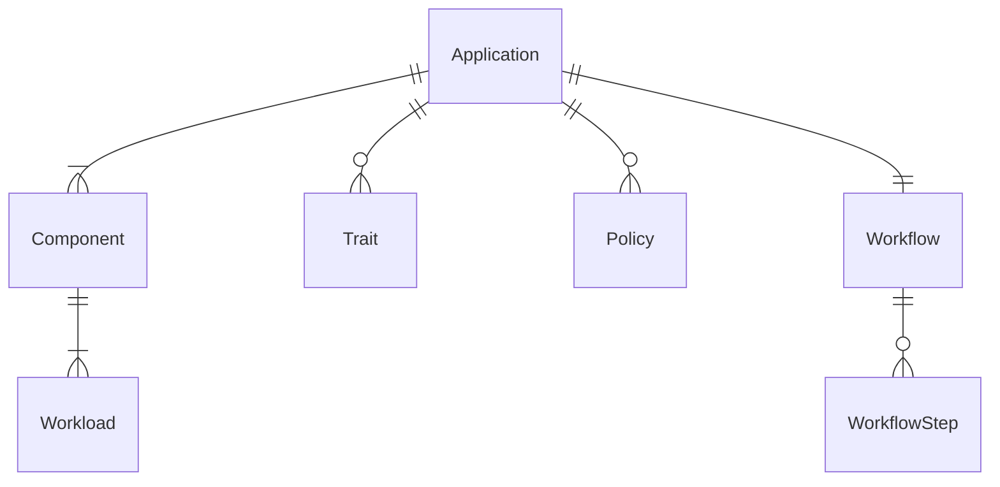

# KubeVela PoC Docs

## OAM Data Model

We define the highlevel
[OAM](https://kubevela.io/docs/platform-engineers/oam/oam-model) 
data model. This model is labeled for v1.2 which is 

Data Model does not have concept of CloudProvider just Region in the data model.



Application is the top level resource:
```yaml
apiVersion: core.oam.dev/v1beta1
kind: Application
metadata:
  name: <name>
spec:
  components:
    - name: <component name>
      type: <component type>
      properties:
        <parameter values>
      traits:
        - type: <trait type>
          properties:
            <traits parameter values>
    - name: <component name>
      type: <component type>
      properties:
        <parameter values>
  policies:
  - name: <policy name>
    type: <policy type>
    properties:
      <policy parameter values>
  workflow:
    - name: <step name>
      type: <step type>
      properties:
        <step parameter values>   
```

Examples of Component Definition:
```yaml
apiVersion: core.oam.dev/v1beta1
kind: ComponentDefinition
metadata:
  name: <ComponentDefinition name>
  annotations:
    definition.oam.dev/description: <Function description>
spec:
  workload: # Workload description
    definition:
      apiVersion: <Kubernetes Workload resource group>
      kind: <Kubernetes Workload types>
  schematic:  # Component description
    cue: # Details of components defined by CUE language
      template: <CUE format template>
```
Here is a more complete example of ComponentDefinition.
```yaml
apiVersion: core.oam.dev/v1beta1
kind: ComponentDefinition
metadata:
  name: helm
  namespace: vela-system
  annotations:
    definition.oam.dev/description: "helm release is a group of K8s resources from either git repository or helm repo"
spec:
  workload:
    type: autodetects.core.oam.dev
  schematic:
    cue:
      template: |
        output: {
          apiVersion: "source.toolkit.fluxcd.io/v1beta1"
          metadata: {
            name: context.name
          }
          if parameter.repoType == "git" {
            kind: "GitRepository"
            spec: {
              url: parameter.repoUrl
              ref:
                branch: parameter.branch
              interval: parameter.pullInterval
            }
          }
          if parameter.repoType == "helm" {
            kind: "HelmRepository"
            spec: {
              interval: parameter.pullInterval
              url:      parameter.repoUrl
              if parameter.secretRef != _|_ {
                secretRef: {
                  name: parameter.secretRef
                }
              }
            }
          }
        }

        outputs: release: {
          apiVersion: "helm.toolkit.fluxcd.io/v2beta1"
          kind:       "HelmRelease"
          metadata: {
            name: context.name
          }
          spec: {
            interval: parameter.pullInterval
            chart: {
              spec: {
                chart:   parameter.chart
                version: parameter.version
                sourceRef: {
                  if parameter.repoType == "git" {
                    kind: "GitRepository"
                  }
                  if parameter.repoType == "helm" {
                    kind: "HelmRepository"
                  }
                  name:      context.name
                  namespace: context.namespace
                }
                interval: parameter.pullInterval
              }
            }
            if parameter.targetNamespace != _|_ {
              targetNamespace: parameter.targetNamespace
            }
            if parameter.values != _|_ {
              values: parameter.values
            }
          }
        }

        parameter: {
          repoType: "git" | "helm"
          // +usage=The Git or Helm repository URL, accept HTTP/S or SSH address as git url.
          repoUrl: string
          // +usage=The interval at which to check for repository and relese updates.
          pullInterval: *"5m" | string
          // +usage=1.The relative path to helm chart for git source. 2. chart name for helm resource
          chart: string
          // +usage=Chart version
          version?: string
          // +usage=The Git reference to checkout and monitor for changes, defaults to master branch.
          branch: *"master" | string
          // +usage=The name of the secret containing authentication credentials for the Helm repository.
          secretRef?: string
          // +usage=The namespace for helm chart
          targetNamespace?: string
          // +usage=Chart version
          value?: #nestedmap
        }

        #nestedmap: {
          ...
        }
```

TraitDefinition provides a series of DevOps actions for the component that can be bound on demand. 
These operation and maintenance actions are usually provided by the platform administrator, 
such as adding a load balancing strategy, routing strategy, or performing scaler, 
gray release strategy, etc.
```yaml
apiVersion: core.oam.dev/v1beta1
kind: TraitDefinition
metadata:
  name: <TraitDefinition name>
  annotations:
    definition.oam.dev/description: <function description>
spec:
  definition:
    apiVersion: <corresponding Kubernetes resource group>
    kind: <corresponding Kubernetes resource type>
  workloadRefPath: <The path to the reference field of the Workload object in the Trait>
  podDisruptive: <whether the parameter update of Trait cause the underlying resource (pod) to restart>
  manageWorkload: <Whether the workload is managed by this Trait>
  skipRevisionAffect: <Whether this Trait is not included in the calculation of version changes>
  appliesToWorkloads:
  - <Workload that TraitDefinition can adapt to>
  conflictsWith:
  - <other Traits that conflict with this><>
  revisionEnabled: <whether Trait is aware of changes in component version>
  schematic:  # Abstract
    cue: # There are many abstracts
      template: <CUE format template>
```
Let's look at a practical example of Trait Definition:

```yaml
apiVersion: core.oam.dev/v1beta1
kind: TraitDefinition
metadata:
  annotations:
    definition.oam.dev/description: "configure k8s Horizontal Pod Autoscaler for Component which using Deployment as worklaod"
  name: hpa
spec:
  appliesToWorkloads:
    - deployments.apps
  workloadRefPath: spec.scaleTargetRef
  schematic:
    cue:
      template: |
        outputs: hpa: {
          apiVersion: "autoscaling/v2beta2"
          kind:       "HorizontalPodAutoscaler"
          spec: {
            minReplicas: parameter.min
            maxReplicas: parameter.max
            metrics: [{
              type: "Resource"
              resource: {
                name: "cpu"
                target: {
                  type:               "Utilization"
                  averageUtilization: parameter.cpuUtil
                }
              }
            }]
          }
        }
        parameter: {
          min:     *1 | int
          max:     *10 | int
          cpuUtil: *50 | int
        }
```

PolicyDefinition is simimarly to TraitDefinition, the difference is that 
TraitDefinition acts on a single component but PolicyDefinition is to act on 
the entire application as a whole (multiple components).

It can provide global policy for applications, commonly including 
global security policies (such as RBAC permissions, auditing, and key management), 
application insights (such as application SLO management, etc.).
```yaml
apiVersion: core.oam.dev/v1beta1
kind: PolicyDefinition
metadata:
  name: <PolicyDefinition name>
  annotations:
    definition.oam.dev/description: <function description>
spec:
  schematic:  # strategy description
    cue: 
      template: <CUE format template>
A specific example is shown below:

apiVersion: core.oam.dev/v1beta1
kind: PolicyDefinition
metadata:
  name: env-binding
  annotations:
    definition.oam.dev/description: <Provide differentiated configuration and environmental scheduling strategies for applications>
spec:
  schematic:
    cue:
      template: |
        output: {
          apiVersion: "core.oam.dev/v1alpha1"
          kind:       "EnvBinding"
          spec: {
            engine: parameter.engine
            appTemplate: {
              apiVersion: "core.oam.dev/v1beta1"
              kind:       "Application"
              metadata: {
                name:      context.appName
                namespace: context.namespace
              }
              spec: {
                components: context.components
              }
            }
            envs: parameter.envs
          }
        }

        #Env: {
          name: string
          patch: components: [...{
            name: string
            type: string
            properties: {...}
          }]
          placement: clusterSelector: {
            labels?: [string]: string
            name?: string
          }
        }

        parameter: {
          engine: *"ocm" | string
          envs: [...#Env]
        }
```
WorkflowStepDefinition is used to describe a series of 
steps that can be declared in the Workflow resource, such as the deployment 
of execution resources, status check, data output, dependent input, 
external script call, etc.
```yaml
apiVersion: core.oam.dev/v1beta1
kind: WorkflowStepDefinition
metadata:
  name: <WorkflowStepDefinition name>
  annotations:
    definition.oam.dev/description: <function description>
spec:
  schematic:  # node description
    cue: 
      template: <CUE format template>
```

Sample WorkflowStepDefinition is as follows:
```yaml
apiVersion: core.oam.dev/v1beta1
kind: WorkflowStepDefinition
metadata:
  name: apply-component
spec:
  schematic:
    cue:
      template: |
        import ("vela/op")
        parameter: {
           component: string
        }

        // load component from application
        component: op.#Load & {
           component: parameter.component
        }

        // apply workload to kubernetes cluster
        apply: op.#ApplyComponent & {
           component: parameter.name
        }

        // wait until workload.status equal "Running"
        wait: op.#ConditionalWait & {
           continue: apply.status.phase =="Running"
        }
```

WorkloadDefinition is a system-level feature. It's not a field that users should
care about but as metadata checked, verified, and used by the OAM system itself.
```yaml
apiVersion: core.oam.dev/v1beta1
kind: WorkloadDefinition
metadata:
  name: <WorkloadDefinition name>
spec:
  definitionRef:
    name: <corresponding Kubernetes resource group>
    version: <corresponding Kubernetes resource version>
  podSpecPath: <path to the Pod field in the Workload>
  childResourceKinds:
    - apiVersion: <resource group>
      kind: <resource type>
```
In addition, other Kubernetes resource type that need to be introduced into 
OAM model in the future will also be added as fields to the workload definition.

