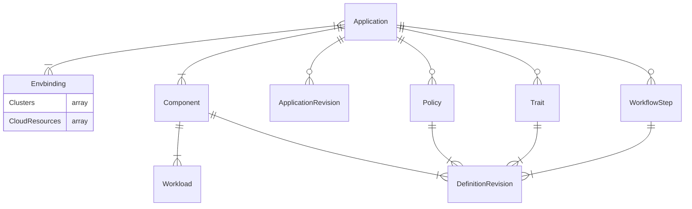

# KubeVela PoC Docs

## OAM Data Model

We define the highlevel
[OAM](https://kubevela.io/docs/platform-engineers/oam/oam-model) 
data model. This model is labeled for v1.2 which is 

Data Model does not have concept of CloudProvider just Region in the data model.
The description of the data model does not have detailed model, here is the list of
CRDS that are installed with 'vela install'
```text
❯ k get crds
NAME                                   CREATED AT
applicationrevisions.core.oam.dev      2022-03-13T19:00:55Z
applications.core.oam.dev              2022-03-13T19:00:55Z
componentdefinitions.core.oam.dev      2022-03-13T19:00:55Z
definitionrevisions.core.oam.dev       2022-03-13T19:00:55Z
envbindings.core.oam.dev               2022-03-13T19:00:55Z
healthscopes.core.oam.dev              2022-03-13T19:00:55Z
manualscalertraits.core.oam.dev        2022-03-13T19:00:55Z
policydefinitions.core.oam.dev         2022-03-13T19:00:55Z
resourcetrackers.core.oam.dev          2022-03-13T19:00:55Z
rollouts.standard.oam.dev              2022-03-13T19:00:56Z
scopedefinitions.core.oam.dev          2022-03-13T19:00:55Z
traitdefinitions.core.oam.dev          2022-03-13T19:00:56Z
workflowstepdefinitions.core.oam.dev   2022-03-13T19:00:56Z
workloaddefinitions.core.oam.dev       2022-03-13T19:00:56Z
```



Application is the top level resource:
```yaml
apiVersion: core.oam.dev/v1beta1
kind: Application
metadata:
  name: <name>
spec:
  components:
    - name: <component name>
      type: <component type>
      properties:
        <parameter values>
      traits:
        - type: <trait type>
          properties:
            <traits parameter values>
    - name: <component name>
      type: <component type>
      properties:
        <parameter values>
  policies:
  - name: <policy name>
    type: <policy type>
    properties:
      <policy parameter values>
  workflow:
    - name: <step name>
      type: <step type>
      properties:
        <step parameter values>   
```

Examples of Component Definition:
```yaml
apiVersion: core.oam.dev/v1beta1
kind: ComponentDefinition
metadata:
  name: <ComponentDefinition name>
  annotations:
    definition.oam.dev/description: <Function description>
spec:
  workload: # Workload description
    definition:
      apiVersion: <Kubernetes Workload resource group>
      kind: <Kubernetes Workload types>
  schematic:  # Component description
    cue: # Details of components defined by CUE language
      template: <CUE format template>
```
Here is a more complete example of ComponentDefinition.
```yaml
apiVersion: core.oam.dev/v1beta1
kind: ComponentDefinition
metadata:
  name: helm
  namespace: vela-system
  annotations:
    definition.oam.dev/description: "helm release is a group of K8s resources from either git repository or helm repo"
spec:
  workload:
    type: autodetects.core.oam.dev
  schematic:
    cue:
      template: |
        output: {
          apiVersion: "source.toolkit.fluxcd.io/v1beta1"
          metadata: {
            name: context.name
          }
          if parameter.repoType == "git" {
            kind: "GitRepository"
            spec: {
              url: parameter.repoUrl
              ref:
                branch: parameter.branch
              interval: parameter.pullInterval
            }
          }
          if parameter.repoType == "helm" {
            kind: "HelmRepository"
            spec: {
              interval: parameter.pullInterval
              url:      parameter.repoUrl
              if parameter.secretRef != _|_ {
                secretRef: {
                  name: parameter.secretRef
                }
              }
            }
          }
        }

        outputs: release: {
          apiVersion: "helm.toolkit.fluxcd.io/v2beta1"
          kind:       "HelmRelease"
          metadata: {
            name: context.name
          }
          spec: {
            interval: parameter.pullInterval
            chart: {
              spec: {
                chart:   parameter.chart
                version: parameter.version
                sourceRef: {
                  if parameter.repoType == "git" {
                    kind: "GitRepository"
                  }
                  if parameter.repoType == "helm" {
                    kind: "HelmRepository"
                  }
                  name:      context.name
                  namespace: context.namespace
                }
                interval: parameter.pullInterval
              }
            }
            if parameter.targetNamespace != _|_ {
              targetNamespace: parameter.targetNamespace
            }
            if parameter.values != _|_ {
              values: parameter.values
            }
          }
        }

        parameter: {
          repoType: "git" | "helm"
          // +usage=The Git or Helm repository URL, accept HTTP/S or SSH address as git url.
          repoUrl: string
          // +usage=The interval at which to check for repository and relese updates.
          pullInterval: *"5m" | string
          // +usage=1.The relative path to helm chart for git source. 2. chart name for helm resource
          chart: string
          // +usage=Chart version
          version?: string
          // +usage=The Git reference to checkout and monitor for changes, defaults to master branch.
          branch: *"master" | string
          // +usage=The name of the secret containing authentication credentials for the Helm repository.
          secretRef?: string
          // +usage=The namespace for helm chart
          targetNamespace?: string
          // +usage=Chart version
          value?: #nestedmap
        }

        #nestedmap: {
          ...
        }
```

TraitDefinition provides a series of DevOps actions for the component that can be bound on demand. 
These operation and maintenance actions are usually provided by the platform administrator, 
such as adding a load balancing strategy, routing strategy, or performing scaler, 
gray release strategy, etc.
```yaml
apiVersion: core.oam.dev/v1beta1
kind: TraitDefinition
metadata:
  name: <TraitDefinition name>
  annotations:
    definition.oam.dev/description: <function description>
spec:
  definition:
    apiVersion: <corresponding Kubernetes resource group>
    kind: <corresponding Kubernetes resource type>
  workloadRefPath: <The path to the reference field of the Workload object in the Trait>
  podDisruptive: <whether the parameter update of Trait cause the underlying resource (pod) to restart>
  manageWorkload: <Whether the workload is managed by this Trait>
  skipRevisionAffect: <Whether this Trait is not included in the calculation of version changes>
  appliesToWorkloads:
  - <Workload that TraitDefinition can adapt to>
  conflictsWith:
  - <other Traits that conflict with this><>
  revisionEnabled: <whether Trait is aware of changes in component version>
  schematic:  # Abstract
    cue: # There are many abstracts
      template: <CUE format template>
```
Let's look at a practical example of Trait Definition:

```yaml
apiVersion: core.oam.dev/v1beta1
kind: TraitDefinition
metadata:
  annotations:
    definition.oam.dev/description: "configure k8s Horizontal Pod Autoscaler for Component which using Deployment as worklaod"
  name: hpa
spec:
  appliesToWorkloads:
    - deployments.apps
  workloadRefPath: spec.scaleTargetRef
  schematic:
    cue:
      template: |
        outputs: hpa: {
          apiVersion: "autoscaling/v2beta2"
          kind:       "HorizontalPodAutoscaler"
          spec: {
            minReplicas: parameter.min
            maxReplicas: parameter.max
            metrics: [{
              type: "Resource"
              resource: {
                name: "cpu"
                target: {
                  type:               "Utilization"
                  averageUtilization: parameter.cpuUtil
                }
              }
            }]
          }
        }
        parameter: {
          min:     *1 | int
          max:     *10 | int
          cpuUtil: *50 | int
        }
```

PolicyDefinition is simimarly to TraitDefinition, the difference is that 
TraitDefinition acts on a single component but PolicyDefinition is to act on 
the entire application as a whole (multiple components).

It can provide global policy for applications, commonly including 
global security policies (such as RBAC permissions, auditing, and key management), 
application insights (such as application SLO management, etc.).
```yaml
apiVersion: core.oam.dev/v1beta1
kind: PolicyDefinition
metadata:
  name: <PolicyDefinition name>
  annotations:
    definition.oam.dev/description: <function description>
spec:
  schematic:  # strategy description
    cue: 
      template: <CUE format template>
A specific example is shown below:

apiVersion: core.oam.dev/v1beta1
kind: PolicyDefinition
metadata:
  name: env-binding
  annotations:
    definition.oam.dev/description: <Provide differentiated configuration and environmental scheduling strategies for applications>
spec:
  schematic:
    cue:
      template: |
        output: {
          apiVersion: "core.oam.dev/v1alpha1"
          kind:       "EnvBinding"
          spec: {
            engine: parameter.engine
            appTemplate: {
              apiVersion: "core.oam.dev/v1beta1"
              kind:       "Application"
              metadata: {
                name:      context.appName
                namespace: context.namespace
              }
              spec: {
                components: context.components
              }
            }
            envs: parameter.envs
          }
        }

        #Env: {
          name: string
          patch: components: [...{
            name: string
            type: string
            properties: {...}
          }]
          placement: clusterSelector: {
            labels?: [string]: string
            name?: string
          }
        }

        parameter: {
          engine: *"ocm" | string
          envs: [...#Env]
        }
```
WorkflowStepDefinition is used to describe a series of 
steps that can be declared in the Workflow resource, such as the deployment 
of execution resources, status check, data output, dependent input, 
external script call, etc.
```yaml
apiVersion: core.oam.dev/v1beta1
kind: WorkflowStepDefinition
metadata:
  name: <WorkflowStepDefinition name>
  annotations:
    definition.oam.dev/description: <function description>
spec:
  schematic:  # node description
    cue: 
      template: <CUE format template>
```

Sample WorkflowStepDefinition is as follows:
```yaml
apiVersion: core.oam.dev/v1beta1
kind: WorkflowStepDefinition
metadata:
  name: apply-component
spec:
  schematic:
    cue:
      template: |
        import ("vela/op")
        parameter: {
           component: string
        }

        // load component from application
        component: op.#Load & {
           component: parameter.component
        }

        // apply workload to kubernetes cluster
        apply: op.#ApplyComponent & {
           component: parameter.name
        }

        // wait until workload.status equal "Running"
        wait: op.#ConditionalWait & {
           continue: apply.status.phase =="Running"
        }
```

WorkloadDefinition is a system-level feature. It's not a field that users should
care about but as metadata checked, verified, and used by the OAM system itself.
```yaml
apiVersion: core.oam.dev/v1beta1
kind: WorkloadDefinition
metadata:
  name: <WorkloadDefinition name>
spec:
  definitionRef:
    name: <corresponding Kubernetes resource group>
    version: <corresponding Kubernetes resource version>
  podSpecPath: <path to the Pod field in the Workload>
  childResourceKinds:
    - apiVersion: <resource group>
      kind: <resource type>
```
In addition, other Kubernetes resource type that need to be introduced into 
OAM model in the future will also be added as fields to the workload definition.

You can specify a generated component instance revision with field spec.components[*].externalRevision 
in Application like below:

```yaml
apiVersion: core.oam.dev/v1beta1
kind: Application
metadata:
  name: myapp
spec:
  components:
    - name: express-server
      type: webservice
      externalRevision: express-server-v1
      properties:
        image: stefanprodan/podinfo:4.0.3
```
If the field is not specified, it will generated by the name rule <component-name>-<revision-number>.

After the Application created, it will generate a ControllerRevision object for each component.

Get the revision for component instance
```sh
$ kubectl get controllerrevision -l controller.oam.dev/component=express-server
NAME                CONTROLLER                       REVISION   AGE
express-server-v1   application.core.oam.dev/myapp   1          2m40s
express-server-v2   application.core.oam.dev/myapp   2          2m12s
```
You can specify the component revision for component rolling update.

When updating an application entity except workflow, 
KubeVela will create a new revision as a snapshot for this change.

```sh
$ kubectl get apprev -l app.oam.dev/name=myapp
NAME       AGE
myapp-v1   54m
myapp-v2   53m
myapp-v3   18s
```
You can get all the information related with the application 
in the application revision, including the application spec, 
and all related definitions.

```yaml
apiVersion: core.oam.dev/v1beta1
kind: ApplicationRevision
metadata:
  labels:
    app.oam.dev/app-revision-hash: a74b4a514ba2fc08
    app.oam.dev/name: myapp
  name: myapp-v3
  namespace: default
  ...
spec:
  application:
    apiVersion: core.oam.dev/v1beta1
    kind: Application
    metadata:
      name: myapp
      namespace: default
      ...
    spec:
      components:
      - name: express-server
        properties:
          image: stefanprodan/podinfo:5.0.3
        type: webservice@v1
     ...
  componentDefinitions:
    webservice:
      apiVersion: core.oam.dev/v1beta1
      kind: ComponentDefinition
      metadata:
        name: webservice
        namespace: vela-system
        ...
      spec:
        schematic:
          cue:
            ...
  traitDefinitions:
    ...
```
Live-diff helps you to have a preview of what would change if you're going to 
upgrade an application without making any changes to the living cluster. 
This feature is extremely useful for serious production deployment, 
and make the upgrade under control

It basically generates a diff between the specific revision of 
running instance and the local candidate application. 
The result shows the changes (added/modified/removed/no_change) of 
the application as well as its sub-resources, such as components and traits.

Assume we're going to upgrade the application like below.
  
```yaml
# new-app.yaml
apiVersion: core.oam.dev/v1beta1
kind: Application
metadata:
  name: myapp
spec:
  components:
    - name: express-server
      type: webservice@v1
      properties:
        image: crccheck/hello-world # change the image
```
Run live-diff like this:

```sh
vela live-diff -f new-app.yaml -r myapp-v1
-r or --revision is a flag that specifies the name of a living ApplicationRevision with which you want to compare the updated application.

-c or --context is a flag that specifies the number of lines shown around a change. The unchanged lines which are out of the context of a change will be omitted. It's useful if the diff result contains a lot of unchanged content while you just want to focus on the changed ones.
```
Click to view the details of diff result
VelaUX uses database for version record, we also recommend you 
to use a database instead of relying on Kubernetes etcd for versioning.

When the capabilities(Component or Trait) changes, 
KubeVela will generate a definition revision automatically.

Check ComponentDefinition Revision
```sh
$  kubectl get definitionrevision -l="componentdefinition.oam.dev/name=webservice" -n vela-system
NAME            REVISION   HASH               TYPE
webservice-v1   1          3f6886d9832021ba   Component
webservice-v2   2          b3b9978e7164d973   Component
```
Check TraitDefinition Revision
```sh
$ kubectl get definitionrevision -l="trait.oam.dev/name=rollout" -n vela-system
NAME         REVISION   HASH               TYPE
rollout-v1   1          e441f026c1884b14   Trait
```
The best way to control version is using a new name for every definition version.

Specify Component/Trait Capability Revision in Application#
Users can specify the revision with @version approach, for example, if a user want to stick to using the v1 revision of webservice component.

System admin can also write a webhook to inject the version automatically.
```yaml
apiVersion: core.oam.dev/v1beta1
kind: Application
metadata:
  name: myapp
spec:
  components:
  - name: express-server
    type: webservice@v1
    properties:
      image: stefanprodan/podinfo:4.0.3
```
In this way, if system admin changes the ComponentDefinition, it won't affect your application.

If no revision specified, KubeVela will always use the latest
revision when you upgrade your application.

Users usually have two or more environments to deploy applications to. 
For example, dev environment to test the application code, and 
production environment to deploy applications to serve live traffic. 
For different environments, the deployment configuration also has some nuance.

```yaml
apiVersion: core.oam.dev/v1beta1
kind: Application
metadata:
  name: example-app
  namespace: demo
spec:
  components:
    - name: hello-world-server
      type: webservice
      properties:
        image: crccheck/hello-world
        port: 8000
      traits:
        - type: scaler
          properties:
            replicas: 1
    - name: data-worker
      type: worker
      properties:
        image: busybox
        cmd:
          - sleep
          - '1000000'
  policies:
    - name: example-multi-env-policy
      type: env-binding
      properties:
        envs:
          - name: test
            placement: # selecting the namespace (in local cluster) to deploy to
              namespaceSelector:
                name: test
            selector: # selecting which component to use
              components:
                - data-worker

          - name: staging
            placement: # selecting the cluster to deploy to
              clusterSelector:
                name: cluster-staging

          - name: prod
            placement: # selecting both namespace and cluster to deploy to
              clusterSelector:
                name: cluster-prod
              namespaceSelector:
                name: prod
            patch: # overlay patch on above components
              components:
                - name: hello-world-server
                  type: webservice
                  traits:
                    - type: scaler
                      properties:
                        replicas: 3

  workflow:
    steps:
      # deploy to test env
      - name: deploy-test
        type: deploy2env
        properties:
          policy: example-multi-env-policy
          env: test

      # deploy to staging env
      - name: deploy-staging
        type: deploy2env
        properties:
          policy: example-multi-env-policy
          env: staging

      # manual check
      - name: manual-approval 
        type: suspend

      # deploy to prod env
      - name: deploy-prod
        type: deploy2env
        properties:
          policy: example-multi-env-policy
          env: prod
```

We apply the Application policy-demo in the example.

Before applying this example application, you need a namespace 
named demo in the current cluster and namespace test in both 
the current cluster and the staging cluster. 
You need namespace prod in cluster cluster-prod as well. 
You can create it by executing cmd kubectl create ns <namespace>.

vela up -f app.yaml
After the Application is created, a configured Application will be created under the demo namespace.

```sh
$ kubectl get app -n demo
NAME          COMPONENT            TYPE         PHASE     HEALTHY   STATUS   AGE
example-app   hello-world-server   webservice   running                      25s
```
