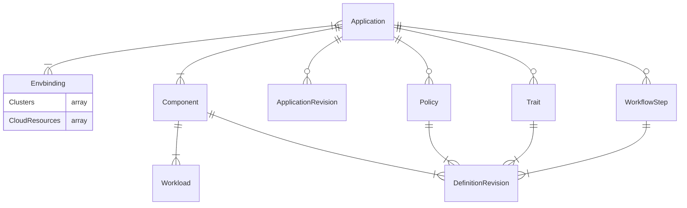
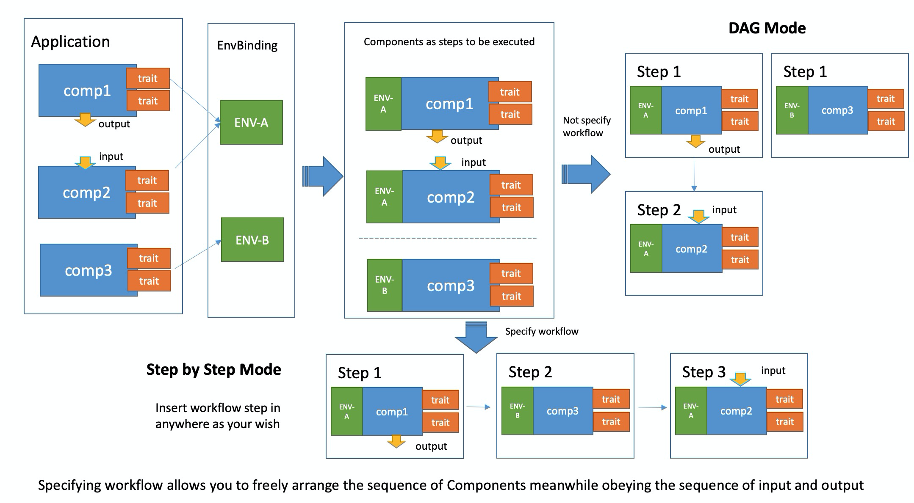

# KubeVela PoC Docs

Initially focused on understanding the data model of kubevela

## OAM Data Model

The highlevel is based around 
[Open Application Model (OAM)](https://kubevela.io/docs/platform-engineers/oam/oam-model),
and we will explore it for v1.2 which is current latest.

The description of the data model is not very detailed, so decided to used the CRD definition
to explore the data model. The other approach would be to look at the 
[API defintion](https://github.com/oam-dev/kubevela/tree/master/apis).

Here is the list of CRDS that are installed with 'vela install'
```text
❯ k get crds
NAME                                   CREATED AT
applicationrevisions.core.oam.dev      2022-03-13T19:00:55Z
applications.core.oam.dev              2022-03-13T19:00:55Z
componentdefinitions.core.oam.dev      2022-03-13T19:00:55Z
definitionrevisions.core.oam.dev       2022-03-13T19:00:55Z
envbindings.core.oam.dev               2022-03-13T19:00:55Z
healthscopes.core.oam.dev              2022-03-13T19:00:55Z
manualscalertraits.core.oam.dev        2022-03-13T19:00:55Z
policydefinitions.core.oam.dev         2022-03-13T19:00:55Z
resourcetrackers.core.oam.dev          2022-03-13T19:00:55Z
rollouts.standard.oam.dev              2022-03-13T19:00:56Z
scopedefinitions.core.oam.dev          2022-03-13T19:00:55Z
traitdefinitions.core.oam.dev          2022-03-13T19:00:56Z
workflowstepdefinitions.core.oam.dev   2022-03-13T19:00:56Z
workloaddefinitions.core.oam.dev       2022-03-13T19:00:56Z
```

***This Model is work in progress I will update it as I find more detail.***


### Application
Application is the top level resource:
```yaml
apiVersion: core.oam.dev/v1beta1
kind: Application
metadata:
  name: <name>
spec:
  components:
    - name: <component name>
      type: <component type>
      properties:
        <parameter values>
      traits:
        - type: <trait type>
          properties:
            <traits parameter values>
    - name: <component name>
      type: <component type>
      properties:
        <parameter values>
  policies:
  - name: <policy name>
    type: <policy type>
    properties:
      <policy parameter values>
  workflow:
    - name: <step name>
      type: <step type>
      properties:
        <step parameter values>   
```

### ComponentDefinition
Examples of Component Definition:
```yaml
apiVersion: core.oam.dev/v1beta1
kind: ComponentDefinition
metadata:
  name: <ComponentDefinition name>
  annotations:
    definition.oam.dev/description: <Function description>
spec:
  workload: # Workload description
    definition:
      apiVersion: <Kubernetes Workload resource group>
      kind: <Kubernetes Workload types>
  schematic:  # Component description
    cue: # Details of components defined by CUE language
      template: <CUE format template>
```
Here is a more complete example of ComponentDefinition.
```yaml
apiVersion: core.oam.dev/v1beta1
kind: ComponentDefinition
metadata:
  name: helm
  namespace: vela-system
  annotations:
    definition.oam.dev/description: "helm release is a group of K8s resources from either git repository or helm repo"
spec:
  workload:
    type: autodetects.core.oam.dev
  schematic:
    cue:
      template: |
        output: {
          apiVersion: "source.toolkit.fluxcd.io/v1beta1"
          metadata: {
            name: context.name
          }
          if parameter.repoType == "git" {
            kind: "GitRepository"
            spec: {
              url: parameter.repoUrl
              ref:
                branch: parameter.branch
              interval: parameter.pullInterval
            }
          }
          if parameter.repoType == "helm" {
            kind: "HelmRepository"
            spec: {
              interval: parameter.pullInterval
              url:      parameter.repoUrl
              if parameter.secretRef != _|_ {
                secretRef: {
                  name: parameter.secretRef
                }
              }
            }
          }
        }

        outputs: release: {
          apiVersion: "helm.toolkit.fluxcd.io/v2beta1"
          kind:       "HelmRelease"
          metadata: {
            name: context.name
          }
          spec: {
            interval: parameter.pullInterval
            chart: {
              spec: {
                chart:   parameter.chart
                version: parameter.version
                sourceRef: {
                  if parameter.repoType == "git" {
                    kind: "GitRepository"
                  }
                  if parameter.repoType == "helm" {
                    kind: "HelmRepository"
                  }
                  name:      context.name
                  namespace: context.namespace
                }
                interval: parameter.pullInterval
              }
            }
            if parameter.targetNamespace != _|_ {
              targetNamespace: parameter.targetNamespace
            }
            if parameter.values != _|_ {
              values: parameter.values
            }
          }
        }

        parameter: {
          repoType: "git" | "helm"
          // +usage=The Git or Helm repository URL, accept HTTP/S or SSH address as git url.
          repoUrl: string
          // +usage=The interval at which to check for repository and relese updates.
          pullInterval: *"5m" | string
          // +usage=1.The relative path to helm chart for git source. 2. chart name for helm resource
          chart: string
          // +usage=Chart version
          version?: string
          // +usage=The Git reference to checkout and monitor for changes, defaults to master branch.
          branch: *"master" | string
          // +usage=The name of the secret containing authentication credentials for the Helm repository.
          secretRef?: string
          // +usage=The namespace for helm chart
          targetNamespace?: string
          // +usage=Chart version
          value?: #nestedmap
        }

        #nestedmap: {
          ...
        }
```

### TraitDefinition
TraitDefinition provides a series of DevOps actions for the component that can be bound on demand. 
These operation and maintenance actions are usually provided by the platform administrator, 
such as adding a load balancing strategy, routing strategy, or performing scaler, 
gray release strategy, etc.
```yaml
apiVersion: core.oam.dev/v1beta1
kind: TraitDefinition
metadata:
  name: <TraitDefinition name>
  annotations:
    definition.oam.dev/description: <function description>
spec:
  definition:
    apiVersion: <corresponding Kubernetes resource group>
    kind: <corresponding Kubernetes resource type>
  workloadRefPath: <The path to the reference field of the Workload object in the Trait>
  podDisruptive: <whether the parameter update of Trait cause the underlying resource (pod) to restart>
  manageWorkload: <Whether the workload is managed by this Trait>
  skipRevisionAffect: <Whether this Trait is not included in the calculation of version changes>
  appliesToWorkloads:
  - <Workload that TraitDefinition can adapt to>
  conflictsWith:
  - <other Traits that conflict with this><>
  revisionEnabled: <whether Trait is aware of changes in component version>
  schematic:  # Abstract
    cue: # There are many abstracts
      template: <CUE format template>
```
Let's look at a practical example of Trait Definition:

```yaml
apiVersion: core.oam.dev/v1beta1
kind: TraitDefinition
metadata:
  annotations:
    definition.oam.dev/description: "configure k8s Horizontal Pod Autoscaler for Component which using Deployment as worklaod"
  name: hpa
spec:
  appliesToWorkloads:
    - deployments.apps
  workloadRefPath: spec.scaleTargetRef
  schematic:
    cue:
      template: |
        outputs: hpa: {
          apiVersion: "autoscaling/v2beta2"
          kind:       "HorizontalPodAutoscaler"
          spec: {
            minReplicas: parameter.min
            maxReplicas: parameter.max
            metrics: [{
              type: "Resource"
              resource: {
                name: "cpu"
                target: {
                  type:               "Utilization"
                  averageUtilization: parameter.cpuUtil
                }
              }
            }]
          }
        }
        parameter: {
          min:     *1 | int
          max:     *10 | int
          cpuUtil: *50 | int
        }
```

### PolicyDefinition
PolicyDefinition is simimarly to TraitDefinition, the difference is that 
TraitDefinition acts on a single component but PolicyDefinition is to act on 
the entire application as a whole (multiple components).

It can provide global policy for applications, commonly including 
global security policies (such as RBAC permissions, auditing, and key management), 
application insights (such as application SLO management, etc.).
```yaml
apiVersion: core.oam.dev/v1beta1
kind: PolicyDefinition
metadata:
  name: <PolicyDefinition name>
  annotations:
    definition.oam.dev/description: <function description>
spec:
  schematic:  # strategy description
    cue: 
      template: <CUE format template>
A specific example is shown below:

apiVersion: core.oam.dev/v1beta1
kind: PolicyDefinition
metadata:
  name: env-binding
  annotations:
    definition.oam.dev/description: <Provide differentiated configuration and environmental scheduling strategies for applications>
spec:
  schematic:
    cue:
      template: |
        output: {
          apiVersion: "core.oam.dev/v1alpha1"
          kind:       "EnvBinding"
          spec: {
            engine: parameter.engine
            appTemplate: {
              apiVersion: "core.oam.dev/v1beta1"
              kind:       "Application"
              metadata: {
                name:      context.appName
                namespace: context.namespace
              }
              spec: {
                components: context.components
              }
            }
            envs: parameter.envs
          }
        }

        #Env: {
          name: string
          patch: components: [...{
            name: string
            type: string
            properties: {...}
          }]
          placement: clusterSelector: {
            labels?: [string]: string
            name?: string
          }
        }

        parameter: {
          engine: *"ocm" | string
          envs: [...#Env]
        }
```

### WorkflowStepDefinition
WorkflowStepDefinition is used to describe a series of
steps that can be declared in the Workflow resource.
The various stemps can perform operations like deployment, status check, 
data output, dependent input, external script call, etc.

#### Built-in Workflow Steps
The following are the built-in workflow types that can be used by WorkflowStepDefinition:
   * suspend: Simplest step type that suspends and waits for manual approval to proceed.
   * deploy2env: The application is deployed to the designated environment defined by EnvBinding.
   * deploy-cloud-resource: Cloud resource applications are delivered to the designated Target. Note that the difference between this type of step and deploy2env is that the CR resource created by the control cloud resource is deployed to the control cluster. After the service is created and the access key (Secret) is generated, the Secret is distributed to the Target designated cluster and Namespace.
   * share-cloud-resource: Distribute the secret generated by a cloud service to the specified targets. Thus when one cloud service is created in a multi-cluster application, and its access key can be shared to the other of multiple clusters.
   * notification: three notification modes: DingTalk, Mail, and Slack, place them in any stage of the workflow to implement message notifications.
   * webhook: place it at any stage of the workflow to call back external systems.)
 
```yaml
apiVersion: core.oam.dev/v1beta1
kind: WorkflowStepDefinition
metadata:
  name: <WorkflowStepDefinition name>
  annotations:
    definition.oam.dev/description: <function description>
spec:
  schematic:  # node description
    cue: 
      template: <CUE format template>
```

Sample WorkflowStepDefinition is as follows:
```yaml
apiVersion: core.oam.dev/v1beta1
kind: WorkflowStepDefinition
metadata:
  name: apply-component
spec:
  schematic:
    cue:
      template: |
        import ("vela/op")
        parameter: {
           component: string
        }

        // load component from application
        component: op.#Load & {
           component: parameter.component
        }

        // apply workload to kubernetes cluster
        apply: op.#ApplyComponent & {
           component: parameter.name
        }

        // wait until workload.status equal "Running"
        wait: op.#ConditionalWait & {
           continue: apply.status.phase =="Running"
        }
```

### WorkloadDefinition
WorkloadDefinition is a system-level feature. It's not a field that users should
care about but as metadata checked, verified, and used by the OAM system itself.
```yaml
apiVersion: core.oam.dev/v1beta1
kind: WorkloadDefinition
metadata:
  name: <WorkloadDefinition name>
spec:
  definitionRef:
    name: <corresponding Kubernetes resource group>
    version: <corresponding Kubernetes resource version>
  podSpecPath: <path to the Pod field in the Workload>
  childResourceKinds:
    - apiVersion: <resource group>
      kind: <resource type>
```
In addition, other Kubernetes resource type that need to be introduced into 
OAM model in the future will also be added as fields to the workload definition.

You can specify a generated component instance revision with field spec.components[*].externalRevision 
in Application like below:

```yaml
apiVersion: core.oam.dev/v1beta1
kind: Application
metadata:
  name: myapp
spec:
  components:
    - name: express-server
      type: webservice
      externalRevision: express-server-v1
      properties:
        image: stefanprodan/podinfo:4.0.3
```
If the field is not specified, it will generated by the name rule <component-name>-<revision-number>.

After the Application created, it will generate a ControllerRevision object for each component.

Get the revision for component instance
```sh
$ kubectl get controllerrevision -l controller.oam.dev/component=express-server
NAME                CONTROLLER                       REVISION   AGE
express-server-v1   application.core.oam.dev/myapp   1          2m40s
express-server-v2   application.core.oam.dev/myapp   2          2m12s
```
You can specify the component revision for component rolling update.

When updating an application entity except workflow, 
KubeVela will create a new revision as a snapshot for this change.

```sh
$ kubectl get apprev -l app.oam.dev/name=myapp
NAME       AGE
myapp-v1   54m
myapp-v2   53m
myapp-v3   18s
```

### ApplicationRevision
You can get all the information related with the application 
in the application revision, including the application spec, 
and all related definitions.

```yaml
apiVersion: core.oam.dev/v1beta1
kind: ApplicationRevision
metadata:
  labels:
    app.oam.dev/app-revision-hash: a74b4a514ba2fc08
    app.oam.dev/name: myapp
  name: myapp-v3
  namespace: default
  ...
spec:
  application:
    apiVersion: core.oam.dev/v1beta1
    kind: Application
    metadata:
      name: myapp
      namespace: default
      ...
    spec:
      components:
      - name: express-server
        properties:
          image: stefanprodan/podinfo:5.0.3
        type: webservice@v1
     ...
  componentDefinitions:
    webservice:
      apiVersion: core.oam.dev/v1beta1
      kind: ComponentDefinition
      metadata:
        name: webservice
        namespace: vela-system
        ...
      spec:
        schematic:
          cue:
            ...
  traitDefinitions:
    ...
```
Live-diff helps you to have a preview of what would change if you're going to 
upgrade an application without making any changes to the living cluster. 
This feature is extremely useful for serious production deployment, 
and make the upgrade under control

It basically generates a diff between the specific revision of 
running instance and the local candidate application. 
The result shows the changes (added/modified/removed/no_change) of 
the application as well as its sub-resources, such as components and traits.

Assume we're going to upgrade the application like below.
  
```yaml
# new-app.yaml
apiVersion: core.oam.dev/v1beta1
kind: Application
metadata:
  name: myapp
spec:
  components:
    - name: express-server
      type: webservice@v1
      properties:
        image: crccheck/hello-world # change the image
```
Run live-diff like this:

```sh
vela live-diff -f new-app.yaml -r myapp-v1
-r or --revision is a flag that specifies the name of a living ApplicationRevision with which you want to compare the updated application.

-c or --context is a flag that specifies the number of lines shown around a change. The unchanged lines which are out of the context of a change will be omitted. It's useful if the diff result contains a lot of unchanged content while you just want to focus on the changed ones.
```
Click to view the details of diff result
VelaUX uses database for version record, we also recommend you 
to use a database instead of relying on Kubernetes etcd for versioning.

When the capabilities(Component or Trait) changes, 
KubeVela will generate a definition revision automatically.

Check ComponentDefinition Revision
```sh
$  kubectl get definitionrevision -l="componentdefinition.oam.dev/name=webservice" -n vela-system
NAME            REVISION   HASH               TYPE
webservice-v1   1          3f6886d9832021ba   Component
webservice-v2   2          b3b9978e7164d973   Component
```
Check TraitDefinition Revision
```sh
$ kubectl get definitionrevision -l="trait.oam.dev/name=rollout" -n vela-system
NAME         REVISION   HASH               TYPE
rollout-v1   1          e441f026c1884b14   Trait
```
The best way to control version is using a new name for every definition version.

Specify Component/Trait Capability Revision in Application:
Users can specify the revision with @version approach, for example, if a user 
want to stick to using the v1 revision of webservice component.

System admin can also write a webhook to inject the version automatically.
```yaml
apiVersion: core.oam.dev/v1beta1
kind: Application
metadata:
  name: myapp
spec:
  components:
  - name: express-server
    type: webservice@v1
    properties:
      image: stefanprodan/podinfo:4.0.3
```
In this way, if system admin changes the ComponentDefinition, it won't affect your application.

If no revision specified, KubeVela will always use the latest
revision when you upgrade your application.

Users usually have two or more environments to deploy applications to. 
For example, dev environment to test the application code, and 
production environment to deploy applications to serve live traffic. 
For different environments, the deployment configuration also has some nuance.

```yaml
apiVersion: core.oam.dev/v1beta1
kind: Application
metadata:
  name: example-app
  namespace: demo
spec:
  components:
    - name: hello-world-server
      type: webservice
      properties:
        image: crccheck/hello-world
        port: 8000
      traits:
        - type: scaler
          properties:
            replicas: 1
    - name: data-worker
      type: worker
      properties:
        image: busybox
        cmd:
          - sleep
          - '1000000'
  policies:
    - name: example-multi-env-policy
      type: env-binding
      properties:
        envs:
          - name: test
            placement: # selecting the namespace (in local cluster) to deploy to
              namespaceSelector:
                name: test
            selector: # selecting which component to use
              components:
                - data-worker

          - name: staging
            placement: # selecting the cluster to deploy to
              clusterSelector:
                name: cluster-staging

          - name: prod
            placement: # selecting both namespace and cluster to deploy to
              clusterSelector:
                name: cluster-prod
              namespaceSelector:
                name: prod
            patch: # overlay patch on above components
              components:
                - name: hello-world-server
                  type: webservice
                  traits:
                    - type: scaler
                      properties:
                        replicas: 3

  workflow:
    steps:
      # deploy to test env
      - name: deploy-test
        type: deploy2env
        properties:
          policy: example-multi-env-policy
          env: test

      # deploy to staging env
      - name: deploy-staging
        type: deploy2env
        properties:
          policy: example-multi-env-policy
          env: staging

      # manual check
      - name: manual-approval 
        type: suspend

      # deploy to prod env
      - name: deploy-prod
        type: deploy2env
        properties:
          policy: example-multi-env-policy
          env: prod
```

You can test the Application versioning using policy-demo example.

Before deploying this example application, you need a namespace 
named demo in the current cluster and namespace test in both 
the current cluster and the staging cluster. 
You need namespace prod in cluster cluster-prod as well. 
You can create it by executing cmd kubectl create ns <namespace>.

vela up -f app.yaml
After the Application is created, a configured Application will be created under the demo namespace.

```sh
$ kubectl get app -n demo
NAME          COMPONENT            TYPE         PHASE     HEALTHY   STATUS   AGE
example-app   hello-world-server   webservice   running                      25s
```

### EnvBindings
Kubevella supports multi-cluster application delivery using EnvBindings reource.

You can simply join an existing cluster into KubeVela by specify its KubeConfig like below:
```sh
vela cluster join <your kubeconfig path>
```
It will use field context.cluster in KubeConfig as the cluster name 
automatically, you can also specify the name by --name parameter. For example:
```bash
vela cluster join stage-cluster.kubeconfig --name cluster-staging
vela cluster join prod-cluster.kubeconfig --name cluster-prod
```
After clusters joined, you could list all clusters managed by KubeVela currently.
```bash
$ vela cluster list
CLUSTER         TYPE    ENDPOINT                
cluster-prod    tls     https://47.88.4.97:6443 
cluster-staging tls     https://47.88.7.230:6443
```
You can also detach a cluster if you're not using it any more.
```bash
$ vela cluster detach cluster-prod
```
If there's still any application running in the cluster, the command will be rejected.

To test this on my local system with kubevela running on kind, I created a minikube cluser
and tried to added it to my kubevela setup. It looks like it is not setup well for local
testing. If I have my context set to minikube or kind I can not get the command to work
the errors are different but still does not work, it looks like vela command line is affected
by the local kubeconfig context setting.
```bash
minikube start
kcluster minikube
k create ns vela-system

kcluster kind-kind
vela cluster join ~/.kube/config --name minikube
Error: failed to ensure vela-system namespace installed in cluster minikube: failed to check if namespace vela-system exists: dial tcp 127.0.0.1:54363: connect: connection refused

kcluster minikube
❯ vela cluster join ~/.kube/config --name minikube
Error: failed to get cluster secret namespace, please ensure cluster gateway is correctly deployed: ClusterGateway APIService v1alpha1.cluster.core.oam.dev is not found
```
***TODO***
Looking at the 
[kubevela CLI cluster source code](https://github.com/oam-dev/kubevela/blob/master/references/cli/cluster.go) 
it looks like the multi-cluster capability is built on
[open-cluster-management.io](https://open-cluster-management.io/concepts/architecture/)
[as you see in kubevela multi-cluster import](https://github.com/oam-dev/kubevela/blob/master/pkg/multicluster/virtual_cluster.go#L28)
and I might need to install more packages on my system to get this to work.

KubeVela regards a Kubernetes cluster as an environment, so you can deploy an 
application into one or more environments.

KubeVela can provide many strategies to deploy an application to
multiple clusters by composing env-binding policy and workflow steps.

You can have a glimpse of how does it work as below
***NOTE: The EnvBinding is bound to Policy not a Trait:***


Below is a concrete example, that deploys to a staging environment first, 
we manually check that the application is running well, and finally 
maually promote to production environment.

For different environments, the deployment configuration can also have some nuance. 
In the staging environment, we only need one replica for the webservice and do not need the worker. 
In the production environment, we setup 3 replicas for the webservice and enable the worker.

```yaml
apiVersion: core.oam.dev/v1beta1
kind: Application
metadata:
  name: example-app
  namespace: default
spec:
  components:
    - name: hello-world-server
      type: webservice
      properties:
        image: crccheck/hello-world
        port: 8000
      traits:
        - type: scaler
          properties:
            replicas: 1
    - name: data-worker
      type: worker
      properties:
        image: busybox
        cmd:
          - sleep
          - '1000000'
  policies:
    - name: example-multi-env-policy
      type: env-binding
      properties:
        envs:
          - name: staging
            placement: # selecting the cluster to deploy to
              clusterSelector:
                name: cluster-staging
            selector: # selecting which component to use
              components:
                - hello-world-server

          - name: prod
            placement:
              clusterSelector:
                name: cluster-prod
            patch: # overlay patch on above components
              components:
                - name: hello-world-server
                  type: webservice
                  traits:
                    - type: scaler
                      properties:
                        replicas: 3

    - name: health-policy-demo
      type: health
      properties:
        probeInterval: 5
        probeTimeout: 10

  workflow:
    steps:
      # deploy to staging env
      - name: deploy-staging
        type: deploy2env
        properties:
          policy: example-multi-env-policy
          env: staging

      # manual check
      - name: manual-approval
        type: suspend

      # deploy to prod env
      - name: deploy-prod
        type: deploy2env
        properties:
          policy: example-multi-env-policy
          env: prod
          
```

After the application deployed, it will run as the workflow steps.

You can refer to EnvBinding and Health Check policy user guide for parameter details.

It will deploy application to staging environment first, you can check the Application status by:
```bash
> kubectl get application example-app
NAME          COMPONENT            TYPE         PHASE                HEALTHY   STATUS       AGE
example-app   hello-world-server   webservice   workflowSuspending   true      Ready:1/1    10s
```

We can see that the workflow is suspended at manual-approval:
```yaml
...
  status:
    workflow:
      appRevision: example-app-v1:44a6447e3653bcc2
      contextBackend:
        apiVersion: v1
        kind: ConfigMap
        name: workflow-example-app-context
        uid: 56ddcde6-8a83-4ac3-bf94-d19f8f55eb3d
      mode: StepByStep
      steps:
      - id: wek2b31nai
        name: deploy-staging
        phase: succeeded
        type: deploy2env
      - id: 7j5eb764mk
        name: manual-approval
        phase: succeeded
        type: suspend
      suspend: true
      terminated: false
      waitCount: 0
```

You can also check the health status in the status.service field below.
```yaml

...
  status:
    services:
    - env: staging
      healthy: true
      message: 'Ready:1/1 '
      name: hello-world-server
      scopes:
      - apiVersion: core.oam.dev/v1alpha2
        kind: HealthScope
        name: health-policy-demo
        namespace: test
        uid: 6e6230a3-93f3-4dba-ba09-dd863b6c4a88
      traits:
      - healthy: true
        type: scaler
      workloadDefinition:
        apiVersion: apps/v1
        kind: Deployment
```

You can use resume the workflow with vela command after everything verified in statging cluster:
```bash
> vela workflow resume example-app
Successfully resume workflow: example-app
```

Recheck the Application status:
```bash
> kubectl get application example-app
NAME          COMPONENT            TYPE         PHASE     HEALTHY   STATUS       AGE
example-app   hello-world-server   webservice   running   true      Ready:1/1    62s
```

```yaml
  status:
    services:
    - env: staging
      healthy: true
      message: 'Ready:1/1 '
      name: hello-world-server
      scopes:
      - apiVersion: core.oam.dev/v1alpha2
        kind: HealthScope
        name: health-policy-demo
        namespace: default
        uid: 9174ac61-d262-444b-bb6c-e5f0caee706a
      traits:
      - healthy: true
        type: scaler
      workloadDefinition:
        apiVersion: apps/v1
        kind: Deployment
    - env: prod
      healthy: true
      message: 'Ready:3/3 '
      name: hello-world-server
      scopes:
      - apiVersion: core.oam.dev/v1alpha2
        kind: HealthScope
        name: health-policy-demo
        namespace: default
        uid: 9174ac61-d262-444b-bb6c-e5f0caee706a
      traits:
      - healthy: true
        type: scaler
      workloadDefinition:
        apiVersion: apps/v1
        kind: Deployment
    - env: prod
      healthy: true
      message: 'Ready:1/1 '
      name: data-worker
      scopes:
      - apiVersion: core.oam.dev/v1alpha2
        kind: HealthScope
        name: health-policy-demo
        namespace: default
        uid: 9174ac61-d262-444b-bb6c-e5f0caee706a
      workloadDefinition:
        apiVersion: apps/v1
        kind: Deployment
```

All the step status in workflow is succeeded:
```yaml
...
  status:
    workflow:
      appRevision: example-app-v1:44a6447e3653bcc2
      contextBackend:
        apiVersion: v1
        kind: ConfigMap
        name: workflow-example-app-context
        uid: e1e7bd2d-8743-4239-9de7-55a0dd76e5d3
      mode: StepByStep
      steps:
      - id: q8yx7pr8wb
        name: deploy-staging
        phase: succeeded
        type: deploy2env
      - id: 6oxrtvki9o
        name: manual-approval
        phase: succeeded
        type: suspend
      - id: uk287p8c31
        name: deploy-prod
        phase: succeeded
        type: deploy2env
      suspend: false
      terminated: false
      waitCount: 0
```

## Que
Kubevela integrates 
[CUE](https://cuelang.org/docs/about/) 
as a first class object to encapsulate, abstract and create Kubernetes resources.

This is a good article about complexity of traditional tooling for Kubernetes
and where 
[CUE addressing Kubernetes](https://blog.cedriccharly.com/post/20191109-the-configuration-complexity-curse/)

This is a good primer showing how CUE has a good way to represent Schema and Data:
```json
// Schema
municipality: {
	name:    string
	pop:     int
	capital: bool
}

// Schema & Data
largeCapital: municipality
largeCapital: {
	name:    string
	pop:     >5M
	capital: true
}

// Data
moscow: largeCapital
moscow: {
	name:    "Moscow"
	pop:     11.92M
	capital: true
}
```
This example shows the CUE data validation capability:
```json
Spec :: {
	kind: string

	name: {
		first:   !="" // must be specified and non-empty
		middle?: !="" // optional, but must be non-empty when specified
		last:    !=""
	}

	// The minimum must be strictly smaller than the maximum and vice versa.
	minimum?: int & <maximum
	maximum?: int & >minimum
}

// A spec is of type Spec
spec: Spec
spec: {
	knid: "Homo Sapiens" // error, misspelled field

	name: first: "Jane"
	name: last:  "Doe"
}
```

This is a [CUE Kubernetes example](https://github.com/cue-lang/cue/blob/v0.4.2/doc/tutorial/kubernetes/README.md).
This is based on CUE version 0.4.2 which is what I have running on my laptop at this time.

I copied the kubernetes tutorials to follow it here:
```bash
❯ cp -rp ../../cue-lang/cue/doc/tutorial/kubernetes example/.
❯ cd example/kubernetes
❯ tree ./original | head
./original
└── services
    ├── frontend
    │   ├── bartender
    │   │   └── kube.yaml
    │   ├── breaddispatcher
    │   │   └── kube.yaml
    │   ├── host
    │   │   └── kube.yaml
    │   ├── maitred
```

